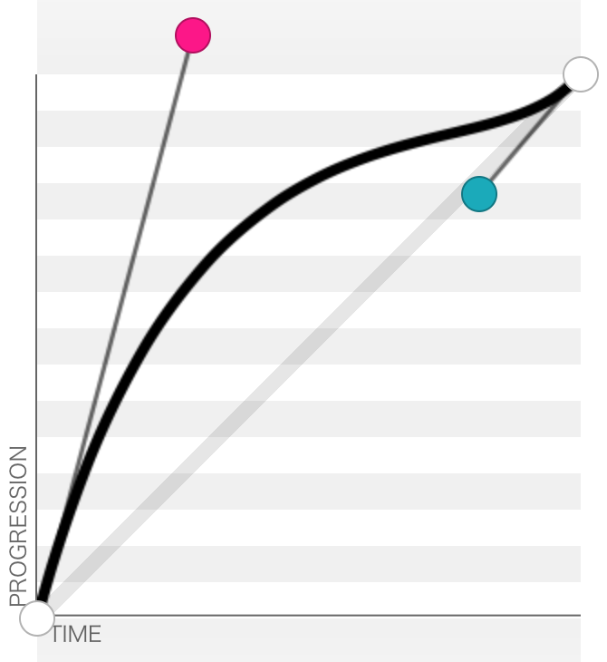

# Abstract

With CSS3 animations, you can write Bezier curves that act as animation timing functions. Bezier curves are generally nice and easy to work with, but it is sometimes difficult to create a Bezier curve that looks just like you want it.

Enter **bezierfit**. With **bezierfit**, you can produce a Bezier curve animation which matches a set of key points *as best as possible* (in a mathematical least-squares sense). For instance, suppose you want an animation to go through completion percentages 30%, 50%, 80%, and 90% at time values 0.1, 0.2, 0.5, and 0.8 respectively. With this information, **bezierfit** can search for the Bezier animation which *best matches* the given parameters.

# Usage

First, you must [install Go](https://golang.org/doc/install) and setup a GOPATH. Once you've done that, run:

```
$ go get github.com/unixpickle/bezierfit
$ cd $GOPATH/src/github.com/unixpickle/bezierfit
```

Now you can run the bezierfit command as follows. For the purpose of example, I will feed the program the example described in the Abstract:

```
$ go run cmd/main.go
Enter lines of the form 'x y'; EOF to finish:
0.1 0.3
0.2 0.5
0.5 0.8
0.8 0.9
Solving...
cubic-bezier(0.287,1.071,0.814,0.780)
```

The bezier curve it provided looks like this:



If you check, this curve passes through the four specified points almost exactly.

# How it works

Solving a least-squares problem like this is an optimization problem (but not necessarily a convex one). There are several numerical tricks behind **bezierfit**:

 * Bezier animations are evaluated at a given X value using bisection search.
 * Gradients of the loss function with respect to Bezier curve parameters are computed using two-point numerical differentiation.
 * Locally optimal bezier animations are discovered through an active set optimization technique based on gradient descent (with a fixed step size).
 * Good local minima are discovered by solving multiple optimization problems from random starting points.

This non-convex optimization problem is relatively easy for a number of reasons. First, there are only four parameters, so even inefficient optimization techniques are relatively quick. Second, all parameters will tend to be around the same order of magnitude (i.e. bezier parameters are all relatively close to the range [0,1]). Third, not too much precision is needed, so using tons of numerical approximations is acceptable.

**UPDATE:** it looks like the space of solutions actually *is* convex, or in the very least quasi-convex. This is worth looking into, because it could mean an automatic 10x speedup (because we wouldn't have to look for multiple local minima).
